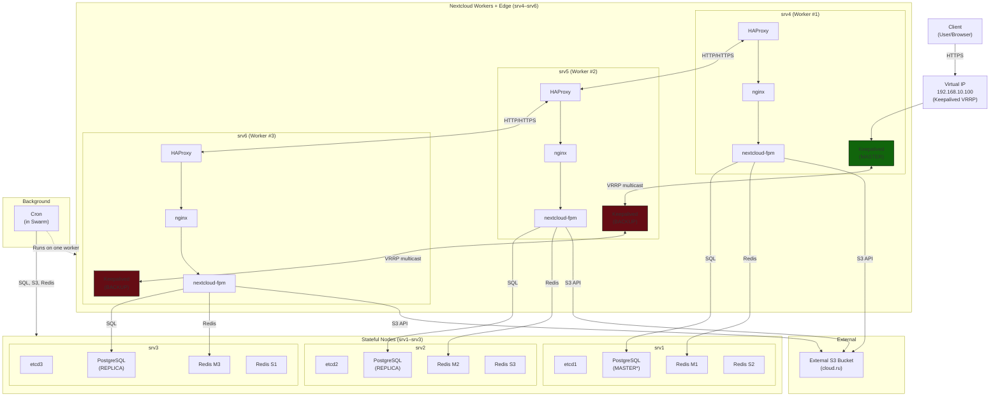

# ansible-nextcloud-ha

Автоматизация развёртывания HA Nextcloud (Docker Swarm) с PostgreSQL (Patroni), Redis Sentinel, HAProxy+Keepalived, S3 backend.

Версии:
- Nextcloud 32.0.1
- PostgreSQL 17.6
- Redis 7
- Ubuntu 22.04 LTS (рекомендуется)

Перед использованием:
- заменить `changeme_*` в `.env` и group_vars на реальные секреты
- переместить секреты в Docker Secrets / Vault
- проверить inventory/hosts.yml и ansible connectivity

## 📁 Структура проекта
```
.
├── ansible.cfg
├── config
│   ├── nginx.conf
│   ├── redis.conf
│   └── sentinel.conf
├── docs
│   └── runbook.md
├── group_vars
│   ├── all.yml
│   ├── lb.yml
│   ├── managers.yml
│   ├── postgres.yml
│   ├── redis.yml
│   └── workers.yml
├── haproxy.cfg
├── haproxy.cfg.gefault
├── inventory
│   └── hosts.yml
├── keepalived.conf
├── keepalived.conf.gefault
├── playbooks
│   ├── 00_prepare.yml
│   ├── 01_swarm.yml
│   ├── 02_lb.yml
│   ├── 03_postgres.yml
│   ├── 04_redis.yml
│   └── 05_deploy_nextcloud.yml
├── README.md
├── roles
│   ├── common
│   │   └── tasks
│   │       └── main.yml
│   ├── docker
│   │   └── tasks
│   │       └── main.yml
│   ├── haproxy
│   │   ├── tasks
│   │   │   └── main.yml
│   │   └── templates
│   │       ├── haproxy.cfg.j2
│   │       └── keepalived.conf.j2
│   ├── monitoring
│   │   └── tasks
│   │       └── main.yml
│   ├── nextcloud_stack
│   │   ├── tasks
│   │   │   └── main.yml
│   │   └── templates
│   │       ├── docker-stack.yml.j2
│   │       └── env.j2
│   ├── postgresql_ha
│   │   ├── tasks
│   │   │   └── main.yml
│   │   └── templates
│   │       └── patroni.yml.j2
│   ├── redis_cluster
│   │   ├── tasks
│   │   │   └── main.yml
│   │   └── templates
│   │       ├── redis.conf.j2
│   │       └── sentinel.conf.j2
│   └── swarm
│       └── tasks
│           ├── init.yml
│           ├── join_manager.yml
│           └── join_worker.yml
└── templates
    ├── nextcloud-config.php.j2
    └── patroni-bootstrap.sh
```

Полезные команды для запуска

# подготовить окружение
export $(cat .env | xargs)

# запустить playbooks
```
ansible-playbook playbooks/00_prepare.yml
ansible-playbook playbooks/01_swarm.yml
ansible-playbook playbooks/02_lb.yml
ansible-playbook playbooks/03_postgres.yml
ansible-playbook playbooks/04_redis.yml
ansible-playbook playbooks/05_deploy_nextcloud.yml
```


