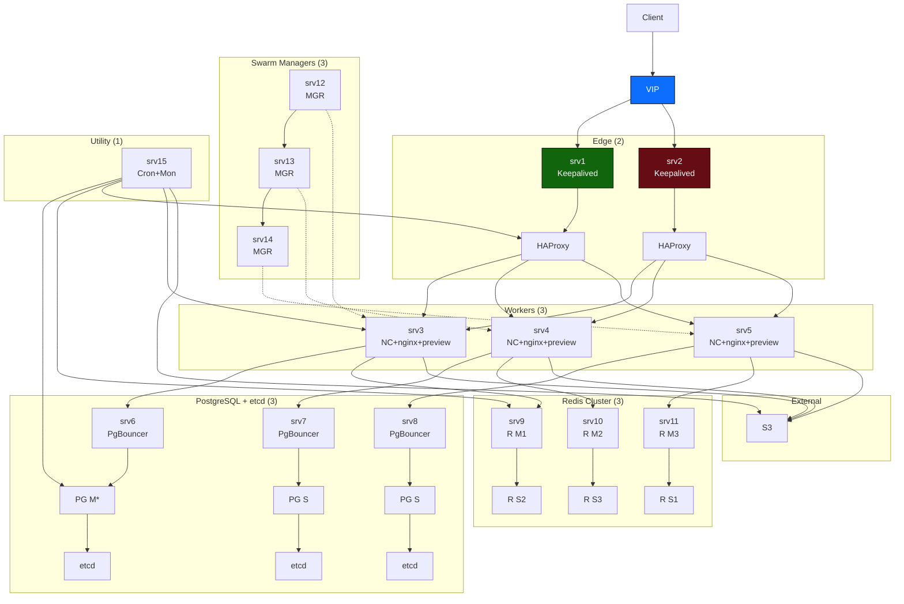

# ansible-nextcloud-ha

Автоматизация развёртывания HA Nextcloud (Docker Swarm) с PostgreSQL (Patroni), Redis Sentinel, HAProxy+Keepalived, S3 backend.

Версии:
- Nextcloud 32.0.1
- PostgreSQL 17.6
- Redis 7
- Ubuntu 22.04 LTS (рекомендуется)

Перед использованием:
- заменить `changeme_*` в `.env` и group_vars на реальные секреты
- переместить секреты в Docker Secrets / Vault
- проверить inventory/hosts.yml и ansible connectivity

## 📁 Структура проекта
```
отрисуй актуальную на данный момент схему (15 серверов) в соответствии с деревом
.
├── ansible.cfg
├── config
│   ├── nginx.conf
│   ├── redis.conf
│   └── sentinel.conf
├── docs
│   └── runbook.md
├── group_vars
│   ├── all.yml
│   ├── lb.yml
│   ├── managers.yml
│   ├── pgbouncer.yml
│   ├── postgres.yml
│   ├── redis.yml
│   └── workers.yml
├── haproxy.cfg.bak
├── inventory
│   └── hosts.yml
├── keepalived.conf
├── keepalived.conf.default
├── playbooks
│   ├── 00_prepare.yml
│   ├── 01_swarm.yml
│   ├── 02_lb.yml
│   ├── 03_postgres.yml
│   ├── 04_redis.yml
│   └── 05_deploy_nextcloud.yml
├── README.md
├── requirements.yml
├── roles
│   ├── common
│   │   └── tasks
│   │       └── main.yml
│   ├── docker
│   │   └── tasks
│   │       └── main.yml
│   ├── haproxy
│   │   ├── tasks
│   │   │   └── main.yml
│   │   └── templates
│   │       ├── haproxy.cfg.j2
│   │       └── keepalived.conf.j2
│   ├── monitoring
│   │   └── tasks
│   │       └── main.yml
│   ├── nextcloud_stack
│   │   ├── tasks
│   │   │   └── main.yml
│   │   └── templates
│   │       ├── docker-stack.yml.j2
│   │       └── env.j2
│   ├── pgbouncer
│   │   ├── handlers
│   │   │   └── main.yml
│   │   ├── tasks
│   │   │   └── main.yml
│   │   └── templates
│   │       └── pgbouncer.ini.j2
│   ├── postgresql_ha
│   │   ├── handlers
│   │   │   └── main.yml
│   │   ├── tasks
│   │   │   └── main.yml
│   │   └── templates
│   │       ├── etcd.env.j2
│   │       └── patroni.yml.j2
│   ├── redis_cluster
│   │   ├── tasks
│   │   │   └── main.yml
│   │   └── templates
│   │       ├── redis.conf.j2
│   │       └── sentinel.conf.j2
│   └── swarm
│       └── tasks
│           ├── init.yml
│           ├── join_manager.yml
│           ├── join_worker.yml
│           └── main.yml
└── templates
    ├── nextcloud-config.php.j2
    └── patroni-bootstrap.sh
```

Полезные команды для запуска

# подготовить окружение
export $(cat .env | xargs)

# запустить playbooks
```
ansible-playbook playbooks/00_prepare.yml
ansible-playbook playbooks/01_swarm.yml
ansible-playbook playbooks/02_lb.yml
ansible-playbook playbooks/03_postgres.yml
ansible-playbook playbooks/04_redis.yml
ansible-playbook playbooks/05_deploy_nextcloud.yml
```



## 🌐 Клиент и балансировка (Edge)
srv1–srv2 — выделенные edge-ноды:
Keepalived: обеспечивает отказоустойчивый виртуальный IP (VIP).
HAProxy: балансирует HTTP/HTTPS-трафик между воркерами.
Цвета: 🟢 srv1 = MASTER, 🔴 srv2 = BACKUP.

## Оркестрация (Control Plane)
srv3–srv5 — только Docker Swarm managers:
Управляют кластером, но не запускают рабочие нагрузки.
Обеспечивают HA control plane (кворум из 3 нод).

## Хранение состояния (Stateful)
PostgreSQL + etcd (srv6–srv8):
Patroni + etcd: управление кластером PostgreSQL с автоматическим failover.
PG M* — текущий мастер (динамически определяется Patroni).
PG S — синхронные реплики.
Redis Cluster (srv9–srv11):
3 master-ноды (R M1–M3) + 3 replica (R S1–S3).
Обеспечивает отказоустойчивый кэш и блокировки для Nextcloud.

## Приложение (Stateless Workers)
srv12–srv14 — чистые воркеры:
Запускают Nextcloud (FPM + nginx) в Docker Swarm.
Не содержат БД, кэша или control plane.
Масштабируются горизонтально.

## Обслуживание и фон
srv15 — единая утилитарная нода:
Cron: выполняет фоновые задачи Nextcloud (occ cron).
Monitoring: Prometheus + Grafana + экспортеры (PostgreSQL, Redis, HAProxy).

## ☁️ Внешние зависимости
S3: все файлы Nextcloud хранятся во внешнем S3-совместимом бакете (никакого локального data/).

Prerequisites (Ansible)
 - Install required Ansible collections:

```bash
ansible-galaxy collection install -r requirements.yml
```

The project uses the `community.docker` collection for Docker-related tasks (secrets, etc.).
